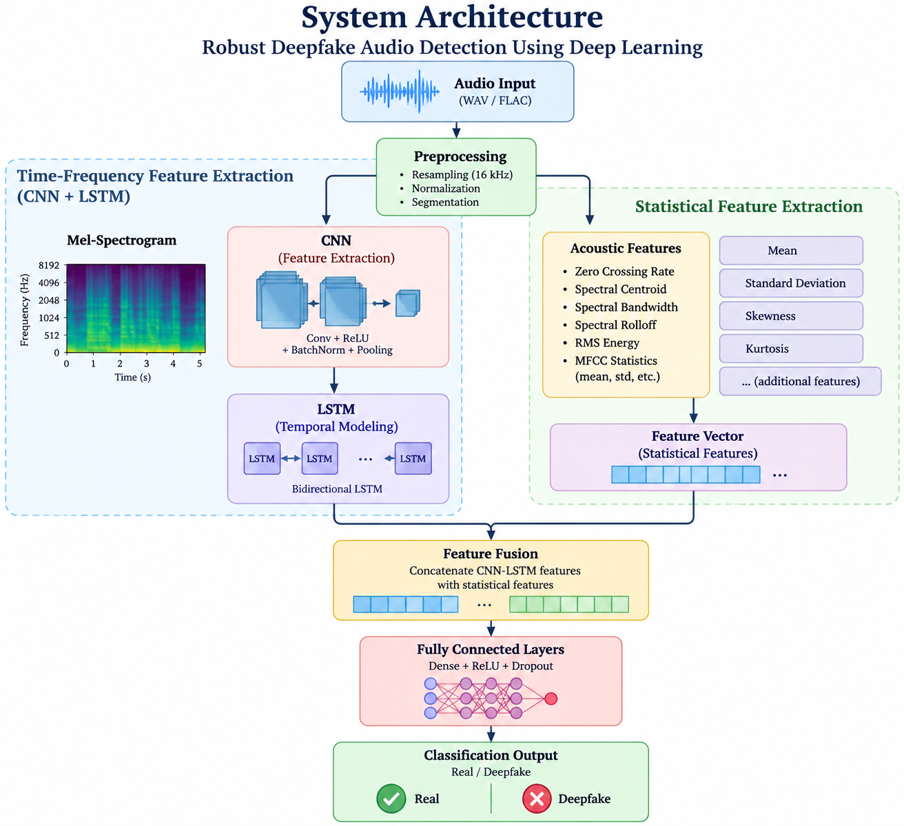

# 🎙️ Robust Deepfake Audio Detection Using Deep Learning

> A hybrid deep learning system for detecting AI-generated audio using
> **Mel-spectrograms, CNN-LSTM modeling, and statistical acoustic features.**

---

## 📌 Overview

Deepfake and synthetic audio generation has become increasingly realistic,
making automated detection an important problem in audio security and
digital media verification.

This project presents a hybrid deep learning approach that combines:

- 🎵 **Mel-spectrogram analysis** for time-frequency representation
- 🧠 **CNN** for spectral feature extraction
- 🔄 **Bidirectional LSTM** for temporal modeling
- 📊 **Statistical acoustic features** for complementary information
- 🔗 **Feature fusion** for final classification
- 🌐 **Streamlit** interface for audio-based prediction

The system classifies an uploaded audio sample as either
**Real (Bonafide)** or **Deepfake (Spoof)**.

---

## 🏗️ System Architecture



```text
                     Audio Input
                         │
                         ▼
                  Preprocessing
                         │
                         ▼
                  Mel-Spectrogram
                         │
                         ▼
                       CNN
                         │
                         ▼
                Bidirectional LSTM
                         │
                         ├──────────────┐
                         │              │
                         │     Statistical Features
                         │              │
                         └──────┬───────┘
                                ▼
                         Feature Fusion
                                │
                                ▼
                      Fully Connected
                                │
                                ▼
                       Real / Deepfake
✨ Key Features
🎧 Deepfake audio detection
🎵 Mel-spectrogram based feature extraction
🧠 CNN-based spectral feature learning
🔄 LSTM-based temporal sequence modeling
📊 Statistical acoustic feature extraction
🔗 Hybrid feature-level fusion
🌐 Streamlit prediction interface
📈 Mel-spectrogram visualization
💾 PyTorch model training and inference
🛠️ Technology Stack
Category	Technology
Programming	Python
Deep Learning	PyTorch
Audio Processing	Librosa
Data Processing	NumPy, Pandas
Visualization	Matplotlib
Web Interface	Streamlit
Dataset	ASVspoof 5
📂 Project Structure
deepfake-audio-detection/
│
├── docs/
│   └── architecture.png
│
├── src/
│   ├── preprocess.py       # Audio feature extraction
│   └── model.py            # CNN-LSTM hybrid model
│
├── data/
│   └── protocols/          # ASVspoof protocol files
│
├── weights/                # Trained model weights
│
├── train.py                # Model training pipeline
├── app.py                  # Streamlit application
├── requirements.txt        # Python dependencies
├── README.md
└── .gitignore


⚙️ Installation
1. Clone the repository
git clone https://github.com/Rohith-kumar-123/deepfake-audio-detection.git
cd deepfake-audio-detection
2. Create a virtual environment
python -m venv .venv
Windows
.venv\Scripts\Activate.ps1
3. Install dependencies
pip install -r requirements.txt
📊 Dataset

The training pipeline is designed for the ASVspoof 5 dataset.

The project expects:

data/
├── protocols/
│   └── ASVspoof5.train.tsv
│
└── flac_T_aa/
    └── *.flac

The dataset is not included in this repository because of its large size.

🧠 Model Pipeline
1. Feature Extraction

Audio is loaded at a sampling rate of 16 kHz and converted into:

Mel-spectrogram features
Spectral-centroid variance
RMS-energy dynamics
2. CNN

The CNN processes the Mel-spectrogram and extracts local spectral patterns.

3. Bidirectional LSTM

CNN features are passed to a bidirectional LSTM to model temporal
dependencies in the audio signal.

4. Feature Fusion

The LSTM representation is combined with the statistical acoustic features.

5. Classification

The fused representation is passed through fully connected layers to
produce the final Real / Deepfake prediction.

🚀 Training

After placing the ASVspoof 5 files in the expected directories:

python train.py

The training pipeline saves model checkpoints inside:

weights/

Example:

model_refined_e1.pth
model_refined_e2.pth
...
model_refined_e10.pth
🌐 Run the Application

Start the Streamlit interface:

streamlit run app.py

The application allows users to:

Upload .wav or .flac audio
Receive a Real / Deepfake prediction
View prediction confidence
Visualize the audio's Mel-spectrogram

📈 Results

The project report reports 99.30% accuracy on the stated validation
dataset.

The report also describes testing on in-the-wild audio samples and notes
that background music and compression can affect predictions.

Results are reported from the project evaluation described in the
accompanying project report.

🔮 Future Improvements

Improve robustness against background noise and compression
Evaluate against a larger and more diverse dataset
Add automated testing for the preprocessing and inference pipeline
Improve inference efficiency
Explore additional audio representations and model architectures

👨‍💻 Authors

R. Rohith Kumar


